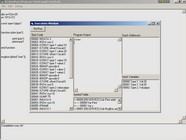



## DC3 Compiler \- Interpreter \(Updated\!\)

### Description

DC3 is a complete but limited (because I've neither the time nor the will to enhance it) VB like compiler/interpreter that can be used for learning how to create a complete and fully functional compiler. It comes with its complete source code in Visual Basic 6.

It compiles simple VB like programs and creates a byte code executed by a Virtual Machine, like Java and .NET languages.   Please Vote for this code!
 
### More Info
 
VB like programs

A compiler is a specialized computer program that converts source code written in one programming language into another language, usually machine language (also called object code or machine code) so that it can be understood by computer processors.

Source code is the version of software (usually an application program or an operating system) as it is originally written (i.e., typed into a computer) by a human in plain text (i.e., human readable alphanumeric characters). Source code can be written in any of numerous programming languages, some of the most popular of which are C, C++, Java, Perl, PHP, Python and Tcl/Tk.

creates a byte code executed by a Virtual Machine

             |
---                |---
**Submitted On**   |2005-06-24 15:43:50
**By**             |[Lorenzi Davide](https://github.com/Planet-Source-Code/PSCIndex/blob/master/ByAuthor/lorenzi-davide.md)
**Level**          |Advanced
**User Rating**    |5.0 (10 globes from 2 users)
**Compatibility**  |VB 5\.0, VB 6\.0
**Category**       |[Complete Applications](https://github.com/Planet-Source-Code/PSCIndex/blob/master/ByCategory/complete-applications__1-27.md)
**World**          |[Visual Basic](https://github.com/Planet-Source-Code/PSCIndex/blob/master/ByWorld/visual-basic.md)
**Archive File**   |[DC3\_Compil1905536252005\.zip](https://github.com/Planet-Source-Code/lorenzi-davide-dc3-compiler-interpreter-updated__1-61332/archive/master.zip)

